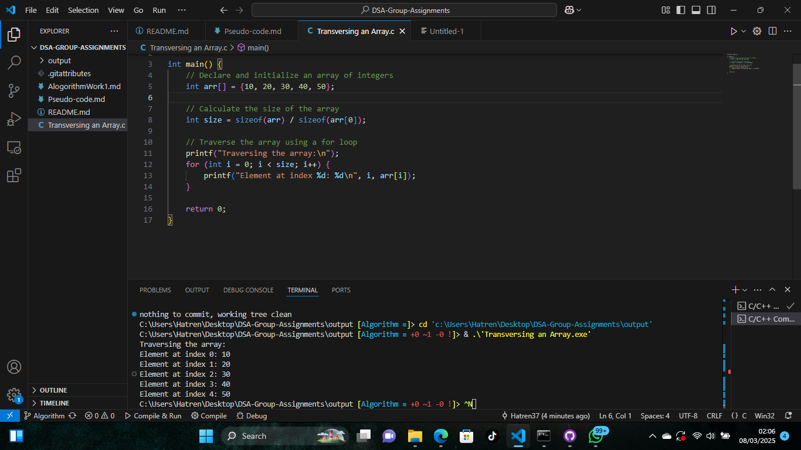

# DSA Group Assignments 1
A C program that calculates the average of marks got by a student in three subjects ie Physics, Chemistry, Math...assume for each subject, four different tests were conducted; assignment, Course work, mid term and end of term exams

